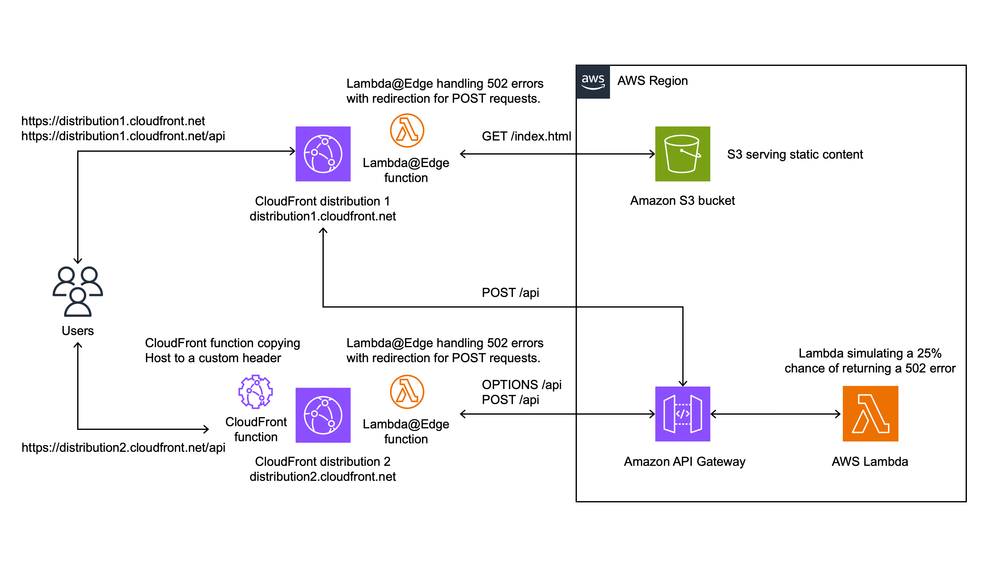

While Nginx reloads are often considered graceful, they are not entirely so in some cases. When customers make configuration changes, Nginx reloads to activate the updates. During this process, idle connections are closed abruptly, and active connections may terminate mid-request. This can result in CloudFront forwarding 502 errors to clients, particularly for POST requests, as CloudFront does not retry these methods. By using Lambda@Edge, this solution ensures seamless retries for POST requests encountering 502 errors, providing a reliable and uninterrupted user experience during Nginx restarts.

# Say-Hi Application

A full-stack web application deployed on AWS using CDK, featuring a React frontend and Lambda backend, distributed through CloudFront. The application demonstrates how to address the challenge of POST request failures caused by Nginx reloads and CloudFront's design to not retry POST requests after 502 errors.

## Architecture



The application consists of:
- Frontend: React SPA hosted in S3 and served through CloudFront
- Backend: AWS Lambda function with API Gateway
  - Lambda simulating a 25% chance of returning a 502 error
- Two CloudFront distributions:
  - Frontend distribution serving the React application and handling single domain scenarios
  - Backend distribution handling CORS scenarios
- Lambda@Edge function handling 502 errors with redirection for POST requests.
  - If the redirect limit is reached (3 times in 60 minutes by default), return the original response

## Prerequisites

- Node.js v22.9.0 or later
- NPM 11.0.0 or later
- AWS CDK 2.175.0 or later
- AWS Account and configured credentials

## Deployment

```
cd static
npm install
npm run build
cd ..
cdk bootstrap
cdk deploy
```

Access the Say-Hi application through SayHiWebsiteURL.

## Clean up

```
cdk destroy
```

You will encounter the error below because the Lambda@Edge function cannot be deleted until the associated CloudFront distributions have been fully deleted. Therefore, you will need to manually retry deleting the SayHiStack on the CloudFormation web console approximately 15 minutes later.

```
... DELETE_FAILED... Lambda was unable to delete...
```

## Security

See [CONTRIBUTING](CONTRIBUTING.md) for more information.

## License

This library is licensed under the MIT-0 License. See the [LICENSE](LICENSE) file.